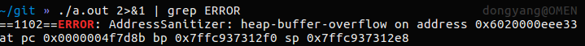
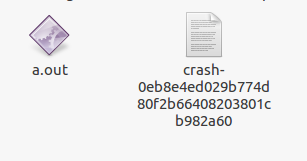

# [libFuzzer Tutorial](https://github.com/google/fuzzing/blob/master/tutorial/libFuzzerTutorial.md)

中文翻译：https://www.cnblogs.com/studyskill/p/7127078.html

https://www.codercto.com/a/21107.html

## libFuzzer初体验

首先克隆一个github的repo

`git clone https://github.com/google/fuzzing.git`

然后编译

```shell
clang++ -g -fsanitize=address -fsanitize-coverage=trace-pi-guard fuzzing/tutorial/libFuzzer/fuzz_me.cc ~/libFuzzer/libFuzzer.a //libFuzzer是你安装libFuzzer是编译生成的文件，需要运行它
```

成功后，输入

`./a.out 2>&1 | grep ERROR`

看到如下信息即可～

```shell
==1102==ERROR: AddressSanitizer: heap-buffer-overflow on address
```




## Hello World 小试牛刀

首先，需要定义一个 fuzz target，这其实是个方程

```C
extern "C" int LLVMFuzzerTestOneInput(const uint8_t *Data, size_t Size) {
  DoSomethingWithData(Data, Size);
  return 0;
}
```

看看fuzz_mer.cc这个源码吧

```c
#include <stdint.h>
#include <stddef.h>

bool FuzzMe(const uint8_t *Data, size_t DataSize) {
  return DataSize >= 3 &&
      Data[0] == 'F' &&
      Data[1] == 'U' &&
      Data[2] == 'Z' &&
      Data[3] == 'Z';  // :‑<
}

extern "C" int LLVMFuzzerTestOneInput(const uint8_t *Data, size_t Size) {
  FuzzMe(Data, Size);
  return 0;
}
         
```

> 拓展：
>
> uint8_t，uint16_t，uint32_t等都不是什么新的数据类型，它们只是使用typedef给类型起的别名，所以以`_t`结尾
>
> 这样都是为了<u>移植</u>而设计出来的类型
>
> 按照POSIX标准，一般整形对应的*_t类型为：
>
>     1字节   uint8_t  ==  unsigned char
>     2字节   uint16_t == unsigned short
>     4字节   uint32_t == unsigned long
>     8字节   uint64_t == unsigned long long
> size_t同理
>
> size_t主要用于计数，如sizeof函数返回值类型即为size_t。在不同位的机器中所占的位数也不同；
> size_t是无符号数，ssize_t是有符号数。
>
> 在32位机器中定义为：typedef  unsigned int size_t; （**4个字节**）
> 在64位机器中定义为：typedef  unsigned long size_t;（8个字节）
>
> 由于size_t是无符号数，因此，**当变量有可能为负数时，必须使用ssize_t**。因为当有符号整型和无符号整型进行运算时，有符号整型会先自动转化成无符号。
>
> ```c
> int main()
> {
>     unsigned short a;
>     short int b = -1;
>     a = b;
>     cout << "b=" << b << endl;  //b=-1
>     cout << "a=" << a << endl;  //a=65535
> }
> ```

To build a fuzzer binary for this target you need to compile the source using the recent **Clang compiler** with the following extra flags:

- `-fsanitize-coverage=trace-pc-guard` (required): provides in-process coverage information to libFuzzer.//在内存中变换
- `-fsanitize=address` (recommended): enables [AddressSanitizer](http://clang.llvm.org/docs/AddressSanitizer.html)
- `-g` (recommended): <u>enables debug info</u>, makes the error messages easier to read.

Then you need to link the target code with `libFuzzer.a` which provides the `main()` function.需要去连接`libFuzzer.a`的原因是它<u>提供了main()方程</u> `libFuzzer.main()`

当你运行`./a.out`时，你应该会看到如下信息

```bash
INFO: Seed: 236105658
INFO: Loaded 1 modules (7 guards): [0x753ea0, 0x753ebc), 
INFO: -max_len is not provided, using 64
INFO: A corpus is not provided, starting from an empty corpus
#0	READ units: 1
#1	INITED cov: 3 ft: 3 corp: 1/1b exec/s: 0 rss: 10Mb
#9	NEW    cov: 4 ft: 4 corp: 2/11b exec/s: 0 rss: 11Mb L: 10 MS: 3 ChangeByte-InsertByte-CMP- DE: "\x00\x00\x00\x00\x00\x00\x00\x00"-
#32384	NEW    cov: 5 ft: 5 corp: 3/43b exec/s: 0 rss: 14Mb L: 32 MS: 3 PersAutoDict-CopyPart-InsertByte- DE: "\x00\x00\x00\x00\x00\x00\x00\x00"-
#133743	NEW    cov: 6 ft: 6 corp: 4/75b exec/s: 0 rss: 21Mb L: 32 MS: 2 CopyPart-ChangeByte-
#423440	NEW    cov: 7 ft: 7 corp: 5/115b exec/s: 0 rss: 42Mb L: 40 MS: 4 CopyPart-CMP-ChangeBinInt-ChangeByte- DE: "\xff\xff\xff\xff\xff\xff\xff\xff"-
=================================================================
==1072==ERROR: AddressSanitizer: heap-buffer-overflow on address 0x6020003e0a73 at pc 0x0000004f7d8b bp 0x7ffe37983040 sp 0x7ffe37983038
READ of size 1 at 0x6020003e0a73 thread T0
    #0 0x4f7d8a in FuzzMe(unsigned char const*, unsigned long) /home/dongyang/git/fuzzing/tutorial/libFuzzer/fuzz_me.cc:9:7
    #1 0x4f7dee in LLVMFuzzerTestOneInput /home/dongyang/git/fuzzing/tutorial/libFuzzer/fuzz_me.cc:13:3
...
```

## Comand

` ./libfuzzer_cfunction -max_len=256 -use_value_profile=1 `


## Option

### Value Profile

使用`-fsanitize coverage=trace-cmp`（默认为-fsanitize=fuzzer）和额外的运行时标志`-use_value_profile=1`，fuzzer将收集比较指令参数的值配置文件，并**将一些新值视为新的覆盖**。        

目前的工作大致如下：       

编译器使用接收两个CMP参数的回调来检测所有CMP指令。        

回调计算 *(caller_pc&4095) | (popcnt(Arg1 ^ Arg2) << 12)* 并使用该值在位集中设置一个位。        

位集中的每个新观测位都被视为新的覆盖范围。        

这个特性有可能发现<u>**许多有趣的输入**</u>，但有两个缺点。首先，额外的方法可能会带来2倍的额外减速。第二，语料库可能会增长几倍。 
This feature has a potential to discover many interesting inputs, but there are two downsides. First, the extra instrumentation may bring up to 2x additional slowdown. Second, the corpus may grow by several times.

### debug

`-g` (recommended) :enables debug info, makes the error messages easier to read.


## Interpretation

让我们来解释下

`INFO: Seed: 236105658`这个Fuzzer通过这个随机的seed开始，我们也可以在命令在加上`-seed=236105658`来获得同样的结果

`INFO: -max_len is not provided, using 64
INFO: A corpus is not provided, starting from an empty corpus`

默认情况下，libFuzzer认为所有的输入都是64比特或者更小，若想要改变它，可以使用 `-max_len=N` 或者使用一个非空的<u>seeds</u>种子语料库

```shell
#0	    READ units: 1
#1	    INITED cov: 3 ft: 3 corp: 1/1b exec/s: 0 rss: 10Mb
#9	    NEW    cov: 4 ft: 4 corp: 2/11b exec/s: 0 rss: 11Mb L: 10 MS: 3 ChangeByte-InsertByte-CMP- DE: "\x00\x00\x00\x00\x00\x00\x00\x00"-
#32384	NEW    cov: 5 ft: 5 corp: 3/43b exec/s: 0 rss: 14Mb L: 32 MS: 3 PersAutoDict-CopyPart-InsertByte- DE: "\x00\x00\x00\x00\x00\x00\x00\x00"-
#133743	NEW    cov: 6 ft: 6 corp: 4/75b exec/s: 0 rss: 21Mb L: 32 MS: 2 CopyPart-ChangeByte-
#423440	NEW    cov: 7 ft: 7 corp: 5/115b exec/s: 0 rss: 42Mb L: 40 MS: 4 CopyPart-CMP-ChangeBinInt-ChangeByte- DE: "\xff\xff\xff\xff\xff\xff\xff\xff"-
```

这说明libFuzzer至少尝试了423440个输入(`#423440`)，并且发现总共115字节的5个输入(`corp: 5/115b`)，总共覆盖了7个覆盖点`cov: 7`，我们可以将覆盖点视为代码中的基本块

```shell
==1072==ERROR: AddressSanitizer: heap-buffer-overflow on address 0x6020003e0a73 at pc 0x0000004f7d8b bp 0x7ffe37983040 sp 0x7ffe37983038
READ of size 1 at 0x6020003e0a73 thread T0
    #0 0x4f7d8a in FuzzMe(unsigned char const*, unsigned long) /home/dongyang/git/fuzzing/tutorial/libFuzzer/fuzz_me.cc:9:7
    #1 0x4f7dee in LLVMFuzzerTestOneInput /home/dongyang/git/fuzzing/tutorial/libFuzzer/fuzz_me.cc:13:3
```

On one of the inputs AddressSanitizer has **detected** a `heap-buffer-overflow` bug and **aborted** the execution.一旦发现溢出就退出。



Before exiting the process libFuzzer has created a file on disc with the bytes that triggered the crash. Take a look at this file. What do you see? Why did it trigger the crash?在退出进程之前，libFuzzer已经在磁盘上创建了一个文件，其中包含触发崩溃的字节。

To reproduce the crash again w/o fuzzing run 如果想要再次看到这个crash的记录可以用下面的命令

```
./a.out crash-0eb8e4ed029b774d80f2b66408203801cb982a60//存储crash的输入。也就是Data
```


