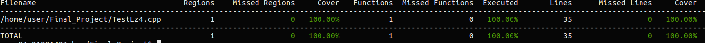
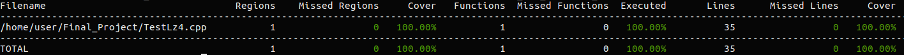
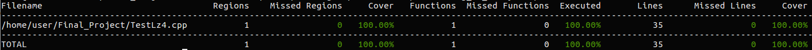
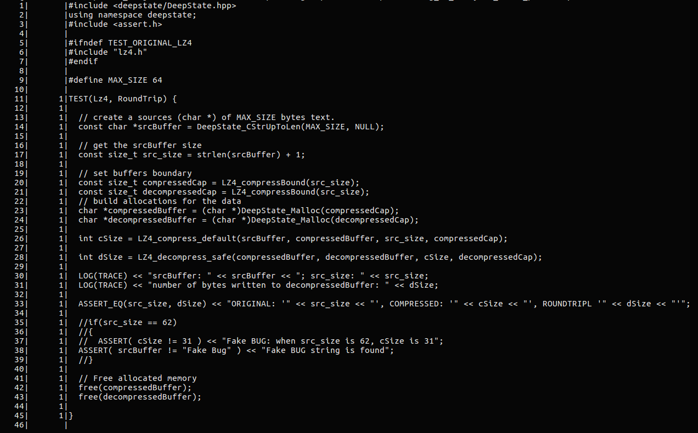
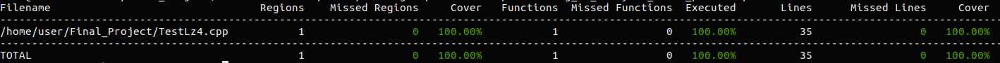

# Prerequisite

I choose a file compression library [lz4](https://github.com/lz4/lz4) to take a round-trip test, which is compression + decompression.

First, in `/home/user` clone the repo.

Then, go to the path  where the header file is.

Last, create static library.

```bash
cd /home/user
git clone https://github.com/lz4/lz4.git
cd lz4/lib
ar -rc lz4.a lz4.o
```

# SYSTEM UNDER TEST

The API that I test is a compression library [LZ4](https://github.com/lz4/lz4),  I choose functions `LZ4_compress_default()` and `LZ4_decompress_safe()` to do a round-trip test. Those two functions description is in the [lz4.h](https://github.com/lz4/lz4/blob/dev/lib/lz4.h#L131). In the test harness, I will compare `cSize` (the number of bytes written into `compressedBuffer`) with `dSize`(the number of bytes written into `decompressedBuffer`)


# FUZZING/TESTING APPROACHES

I use AFL and libFuzzer to fuzz my harness function. For AFL, I use it with `-d` and without `-d` as separate fuzzers. For libFuzzer, I use it with and without `-use_value_profile=1` as separate fuzzers too. The commands are as follows:

`deepstate-afl -i seeds/ -o afl_out/ ./AFL_testlz4 `

`deepstate-afl -i seeds/ -o afl_out_with_quickAnddirtyMode/ --dirty_mode ./AFL_testlz4 ` quick & dirty mode (skips deterministic steps)

`./LF_testlz4 seeds/ `

`./LF_testlz4 seeds/  -use_value_profile=1  `(with value profile set to 1)

After bug injection, and the timeout I set is 10 minutes, which is 600 seconds.

`deepstate-afl -i seeds/ -o bug_injected_afl_out/ ./AFL_testlz4 -t=600 `

`deepstate-afl -i seeds/ -o bug_injected_afl_out_with_quickAnddirtyMode/ --dirty_mode ./AFL_testlz4 -t=600 `

`./LF_testlz4 bug_injected_lf_corpus -max_total_time=600`

`./LF_testlz4 bug_injected_lf_corpus_with_value_profile/ -max_total_time=600 -use_value_profile=1`

Since my harness function has nothing to do with geometric algebra, and symbolic execution is harder when the same memory location can be accessed through aliasing, i didn't use symbolic execution in my test.

# BUG INFORMATION

Since the fuzzers that I used didn't find a real bug, inject one bug. The bug is that if the source buffer is equal to"Fake Bug", the program will crash.

`ASSERT( srcBuffer != "Fake Bug" ) << "Fake BUG string is found";`

## COMPARISON OF TOOLS

## Steps to create coverage report

### Step 1: Compile with coverage enabled.

`clang++ -fprofile-instr-generate -fcoverage-mapping TestLz4.cpp -I/home/user/lz4/lib /home/user/lz4/lib/lz4.a -o CoverageReport -ldeepstate -lpthread`

### Step 2: Run the program.

` LLVM_PROFILE_FILE="bug_afl_analysis.profraw" ./CoverageReport -input_test_dir bug_injected_afl_out/queue`

`LLVM_PROFILE_FILE="bug_afl_analysis_quickAnddirtyMode.profraw" ./CoverageReport -input_test_dir bug_injected_afl_out_with_quickAnddirtyMode/queue/`

`LLVM_PROFILE_FILE="bug_lf_analysis.profraw" ./CoverageReport -input_test_dir bug_injected_lf_corpus`

`LLVM_PROFILE_FILE="bug_lf_analysis_value_profile.profraw" ./CoverageReport -input_test_dir bug_injected_lf_corpus_with_value_profile/`

#### Step 3(a): Index the raw profile.

`llvm-profdata-6.0 merge -sparse bug_afl_analysis.profraw -o bug_afl_analysis.profdata `

`llvm-profdata-6.0 merge -sparse bug_afl_analysis_quickAnddirtyMode.profraw -o bug_afl_analysis_quickAnddirtyMode.profdata `

`llvm-profdata-6.0 merge -sparse bug_lf_analysis.profraw -o bug_lf_analysis.profdata `

`llvm-profdata-6.0 merge -sparse bug_lf_analysis_value_profile.profraw -o bug_lf_analysis_value_profile.profdata `

### Step 3(b): Create a line-oriented coverage report.

`llvm-cov-6.0 show ./CoverageReport -instr-profile=XXX.profdata` The 'XXX in command is the profdata file name that you want to watch.

### Step 3(c): Create a file-oriented coverage report.

`llvm-cov report ./CoverageReport -instr-profile=XXX.profdata` The 'XXX in command is the profdata file name that you want to watch.

## Results

## AFL without quick and dirty mode

Since I don't use loop in my test harness function, each line will be run once. For example, if I run `llvm-cov-6.0 show ./CoverageReport -instr-profile=bug_afl_analysis.profdata`, the result is below:

```bash
user@4c21991422eb:~/Final_Project$ llvm-cov-6.0 show ./CoverageReport -instr-profile=bug_afl_analysis.profdata 
    1|       |#include <deepstate/DeepState.hpp>
    2|       |using namespace deepstate;
    3|       |#include <assert.h>
    4|       |
    5|       |#ifndef TEST_ORIGINAL_LZ4
    6|       |#include "lz4.h"
    7|       |#endif
    8|       |
    9|       |#define MAX_SIZE 64
   10|       |
   11|      1|TEST(Lz4, RoundTrip) {
   12|      1|
   13|      1|  // create a sources (char *) of MAX_SIZE bytes text.
   14|      1|  const char *srcBuffer = DeepState_CStrUpToLen(MAX_SIZE, NULL);
   15|      1|  
   16|      1|  // get the srcBuffer size
   17|      1|  const size_t src_size = strlen(srcBuffer) + 1;
   18|      1|
   19|      1|  // set buffers boundary
   20|      1|  const size_t compressedCap = LZ4_compressBound(src_size);
   21|      1|  const size_t decompressedCap = LZ4_compressBound(src_size);
   22|      1|  // build allocations for the data
   23|      1|  char *compressedBuffer = (char *)DeepState_Malloc(compressedCap);
   24|      1|  char *decompressedBuffer = (char *)DeepState_Malloc(decompressedCap);
   25|      1|
   26|      1|  int cSize = LZ4_compress_default(srcBuffer, compressedBuffer, src_size, compressedCap);
   27|      1|  
   28|      1|  int dSize = LZ4_decompress_safe(compressedBuffer, decompressedBuffer, cSize, decompressedCap);
   29|      1|
   30|      1|  LOG(TRACE) << "srcBuffer: " << srcBuffer << "; src_size: " << src_size;
   31|      1|  LOG(TRACE) << "number of bytes written to decompressedBuffer: " << dSize;
   32|      1|
   33|      1|  ASSERT_EQ(src_size, dSize) << "ORIGINAL: '" << src_size << "', COMPRESSED: '" << cSize << "', ROUNDTRIPL '" << dSize << "'";
   34|      1|
   35|      1|  //if(src_size == 62)
   36|      1|  //{
   37|      1|  //  ASSERT( cSize != 31 ) << "Fake BUG: when src_size is 62, cSize is 31";
   38|      1|  ASSERT( srcBuffer != "Fake Bug" ) << "Fake BUG string is found";
   39|      1|  //}
   40|      1|   
   41|      1|  // Free allocated memory
   42|      1|  free(compressedBuffer);
   43|      1|  free(decompressedBuffer);
   44|      1|
   45|      1|}
   46|       |
```

When I try to generate a file-level summary of coverage statistics using `llvm-cov-6.0 report ./CoverageReport -instr-profile=bug_afl_analysis.profdata` for AFL without quick and dirty mode, the result is shown below:



The code coverage is 100%, which is excited!

## AFL with quick and dirty mode

When I run `llvm-cov-6.0 show ./CoverageReport -instr profile=bug_afl_analysis_quickAnddirtyMode.profdata`, the result is the same as the result above.

```bash
    1|       |#include <deepstate/DeepState.hpp>
    2|       |using namespace deepstate;
    3|       |#include <assert.h>
    4|       |
    5|       |#ifndef TEST_ORIGINAL_LZ4
    6|       |#include "lz4.h"
    7|       |#endif
    8|       |
    9|       |#define MAX_SIZE 64
   10|       |
   11|      1|TEST(Lz4, RoundTrip) {
   12|      1|
   13|      1|  // create a sources (char *) of MAX_SIZE bytes text.
   14|      1|  const char *srcBuffer = DeepState_CStrUpToLen(MAX_SIZE, NULL);
   15|      1|  
   16|      1|  // get the srcBuffer size
   17|      1|  const size_t src_size = strlen(srcBuffer) + 1;
   18|      1|
   19|      1|  // set buffers boundary
   20|      1|  const size_t compressedCap = LZ4_compressBound(src_size);
   21|      1|  const size_t decompressedCap = LZ4_compressBound(src_size);
   22|      1|  // build allocations for the data
   23|      1|  char *compressedBuffer = (char *)DeepState_Malloc(compressedCap);
   24|      1|  char *decompressedBuffer = (char *)DeepState_Malloc(decompressedCap);
   25|      1|
   26|      1|  int cSize = LZ4_compress_default(srcBuffer, compressedBuffer, src_size, compressedCap);
   27|      1|  
   28|      1|  int dSize = LZ4_decompress_safe(compressedBuffer, decompressedBuffer, cSize, decompressedCap);
   29|      1|
   30|      1|  LOG(TRACE) << "srcBuffer: " << srcBuffer << "; src_size: " << src_size;
   31|      1|  LOG(TRACE) << "number of bytes written to decompressedBuffer: " << dSize;
   32|      1|
   33|      1|  ASSERT_EQ(src_size, dSize) << "ORIGINAL: '" << src_size << "', COMPRESSED: '" << cSize << "', ROUNDTRIPL '" << dSize << "'";
   34|      1|
   35|      1|  //if(src_size == 62)
   36|      1|  //{
   37|      1|  //  ASSERT( cSize != 31 ) << "Fake BUG: when src_size is 62, cSize is 31";
   38|      1|  ASSERT( srcBuffer != "Fake Bug" ) << "Fake BUG string is found";
   39|      1|  //}
   40|      1|   
   41|      1|  // Free allocated memory
   42|      1|  free(compressedBuffer);
   43|      1|  free(decompressedBuffer);
   44|      1|
   45|      1|}
   46|       |
```

When I try to generate a file-level summary of coverage statistics using `llvm-cov-6.0 report ./CoverageReport -instr-profile=bug_afl_analysis_quickAnddirtyMode.profdata` for AFL without quick and dirty mode, the result is shown below:



## libFuzzer without use_value_profile=1

We can get the result using `llvm-cov-6.0 show ./CoverageReport -instr-profile=bug_lf_analysis.profdata`. And the result is same. To get the enitre report, commnad `llvm-cov-6.0 report ./CoverageReport -instr-profile=bug_lf_analysis.profdata`, we will get the result below:




## libFuzzer with use_value_profile=1

Using `llvm-cov-6.0 show ./CoverageReport -instr-profile=bug_lf_analysis_value_profile.profdata` to get the line by line coverage report.



Using `llvm-cov-6.0 report ./CoverageReport -instr-profile=bug_lf_analysis_value_profile.profdata` to get the file-oriented coverage report. The coverage is 100%, which is pretty cool for my harness test.




I think the timeout I used is not sufficient for good fuzzing because it doesn't find my bug. And the timeout that I used is only 10 minutes. In my opinion, the timeout for different testings is not the same, which should depend on the scale of the test function.

Another inspiration I got is that code coverage is not equal to test quality. Even if the code coverage reaches 100%, the test has passed, it does not mean that it fully covers all possible situations in actual use. Just like the fake bug I injected, the fuzzers didn't find it but the coverage was still 100%.