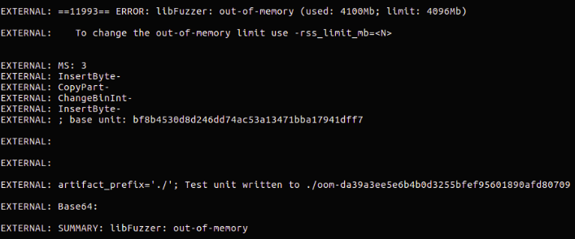
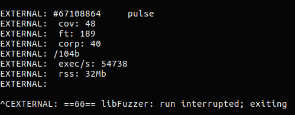
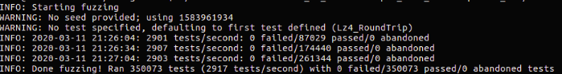
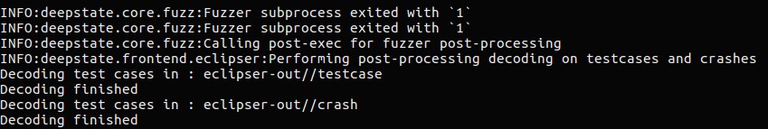
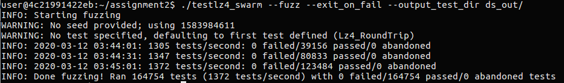

# Introduction

The API that I test is a compression library [LZ4](https://github.com/lz4/lz4),  I choose functions `LZ4_compress_default()` and `LZ4_decompress_safe()` to do a round-trip test. Those two functions description is in the [lz4.h](https://github.com/lz4/lz4/blob/dev/lib/lz4.h#L131). In the test harness, I will compare `cSize` (the number of bytes written into `compressedBuffer`) with `dSize`(the number of bytes written into `decompressedBuffer`)

The test results are shown below.

# AFL

Since deepstate has already supported AFL, libFuzzer and other fuzzers, I use `deepstate-afl -i afl_in/ --output_test_dir afl_out/ ./testlz4_AFL` to execute the AFL fuzzer through DeepState. The fuzzing process are too slow, it takes more than 2 hours to progress to green when the fuzzer hasn't been seeing any action for a long time. In my opinion, it's very time consuming.

It complete more than 6000 cycles, and the total execs are more than 2 million. But there are only 4 paths that the fuzzer favored, there are no crashes and timeouts. I didn't find anything interesting using AFL.

# libFuzzer 

When I fuzz the API using libFuzzer, I realized that I made a mistake until the SUMMARY told me that libFuzzer is out of memory. The reason is that because I didn't free the memory that I allocated. But when I check the DeepState document, it didn't mention whether to free the memory when we call` DeepState_CStrUpToLen/DeepState_CStr_C`. Then I check the source code and ask my professor, the answer is that those two functions will free the memory at last. It's a good experience for me to check if the memory allocated need to free when I write the C code.

I use the command `./testlz4_LF lf_corpus/ -use_value_profile=1`and run the libFuzzer again after adding the free functions. After running about 30 minutes, it has tried at least 67108864 inputs(#67108864), found 40 entries with a total of 104 b and covered 48 edges(cov: 48). But libFuzzer doesn't find any crashes, too. 

# DeepState

I use command `./testlz4 --fuzz --exit_on_fail --output_test_dir ds_out/` to run the DeepState fuzzer. Compared with AFL and libFuzzer, DeepState only need a minute to complete the fuzzing. And it doesn't find any crashes too. It's so powerful that DeepState can complete more than one thousand tests per second. The most important part is to determine the symbolic variables or values. During the execution,those data will be prefilled by the DeepState Fuzzer. In my test harness. I choose the `srcBuffer` as my symblic variable, and call `DeepState_Malloc()` to give the variable random data. Then I try to test the round trip property. First, I compress the `scrBuffer`. Then, I decompress the data to get the number of bytes that written to the buffer. Last, I compare the original number of bytes with the number of bytes after decompression. If the assertion is false, some postcondition macros will mark the those test as failed and treat them as crashes.

# Eclipser

And I read an article [Fuzzing Unit Tests with DeepState and Eclipser](https://blog.trailofbits.com/2019/05/31/fuzzing-unit-tests-with-deepstate-and-eclipser), it says that Eclipser provides many benefits of symbolic execution in fuzzing, but it doesn't have the high computational and memory overhead associated with symbolic execution. I think it's very powerful because it doesn't take up too much CPU. 

`deepstate-eclipser ./testlz4 --output_test_dir eclipser-out`

And the result is the same, there are no crashes found. But at the beginning, I don't know why there are som unhandled exceptions if I doesn't create the testcase and crash folders.

# Swarm Testing

Swarm testing is an approach to test generation that modifies the distributions of finite choices, so I try to use it to do the fuzzing. I follow the instruction in [document](https://github.com/trailofbits/deepstate/blob/master/docs/swarm_testing.md), and compile my harness with `-DDEEPSTATE_PURE_SWARM`

The result is still same. Swarm testing doesn't find any crashes.

In summary, my round trip test works, and the API doesn't have bugs. Compared with those different fuzzers, in terms of fuzzing time, the DeepState is faster than AFL and libFuzzer. In addition, DeepState provides calls to generate most of the basic data types. For example, DeepState_Int(), DeepState_Char() can return the corresponding symbolic values. For strins, just like I use the DeepState_CStrUpToLen(), it will return a pointer to an array of symbolic chars, and the max length will be the parameter you pass into the function. And those two function will free the memory allocated in the end. But if we use DeepState_Malloc(), we still need to free those pointers, otherwise, it will cause some problems. For example, in my libFuzzer testing, it tells me it's out of memory.

