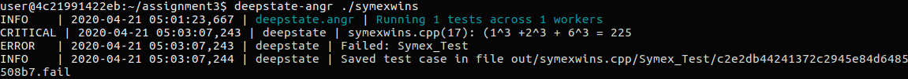

# Fuzzing is better!

For the case that fuzzing is better, I choose the same file in my assignment 2. About how to fuzzing the TestLz4.cpp file, please go to the "assignment 2" folder to check the README. When I test the harness from assignment 2 using symbolic execution, it takes up so much memory that my computer runs very slowly. But for fuzzing, like AFL, libfuzzer etc., they focus on providing sufficient random inputs to the test function to find potential crashes. Therefore, in this case, fuzzing will be better when test a library.

In this case, symbolic execution is worse than fuzzing because it's used to analyze a program where it uses the symbolic values as input instead of concrete values. When the target code is reached, it will get  the path constraints, and then get specific values that satisfy the codes. But symbolic execution has some limitations, the number of feasible paths grows exponentially with an increase in program size and can even be infinite in the case of programs with unbounded loop iterations. In addition, symbolic execution is harder when the same memory location can be accessed through aliasing. Since aliasing cannot always be recognized statically, the symbolic execution cannot recognize that a change to the value of a variable also changes the other. 

# Symbolic execution is better!



For symbolic execution, the equation I used is that the sum of the cubes of three numbers equals the square of a number. When I use symbolic execution to find the fake bug, it only takes me 2 minutes. However, fuzzers like AFL or Libfuzzer cannot find it even though it takes a long time. The reason why symbolic execution finds the 'bug' so quickly is because it assumes symbolic values for inputs rather than using actual inputs as normal execution  of the program would like AFL. During a normal execution, like fuzzing, it would read a concrete input value and assign it to variables and then proceed with the multiplication. When I try to find an example where fuzzing will do poorly on, I realized that fuzzing is strong too because when I try some harness, they can both find the fake bug quickly. For example, I try to swap two values and them compare the value of them. It's interesting that both of them can find it quickly. 

```c
TEST(Symex, Test) {
  unsigned a = DeepState_UIntInRange(1,10000);
  unsigned b = DeepState_UIntInRange(1,10000);
  if( a > b)
    {
     a = a + b;
     b = a - b;
     a = a - b;

     ASSERT( a > b ) << a << " <= " << b
    }
}
```

I am too naive to think that a more logical swapping may confuse fuzzers. So, I try to use a more complicated equation to stumble AFL or other fuzzers. And I made it. I use the equation that sum of the cubes of three numbers equals the square of a number. AFL cannot find the fake bug any more! 

```c
(a^3 + b^3 + c^3) == result^2
```

Therefore, I think fuzzing is hard to find some bugs in complicated algebraic equations but it's good in some simple equations.

The most major difference between fuzzing and symbolic execution is the way that they work. Fuzzing will produce much random data as inputs through mutations. Then using those data to test functions and try to find crashes. While the main idea of symbolic execution is to represent variables with symbols instead of specific values. Hence, that's why we need seeds or corpus when we fuzz functions, but we don't need them when we use the symbolic execution.